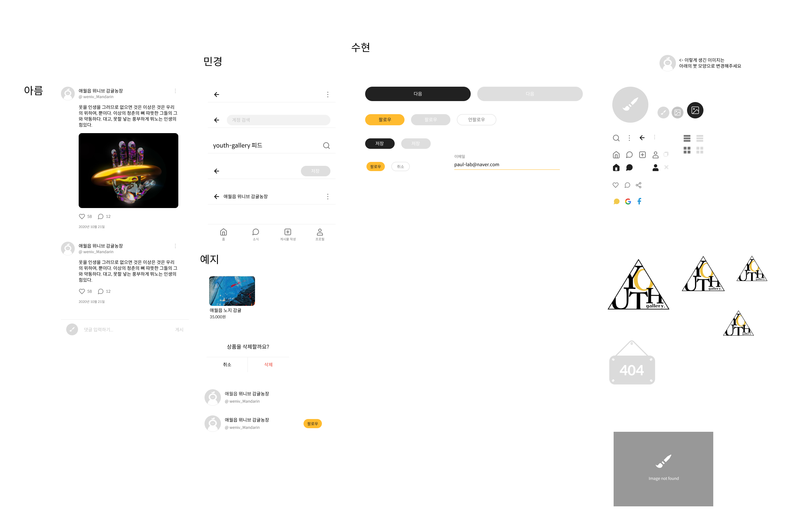
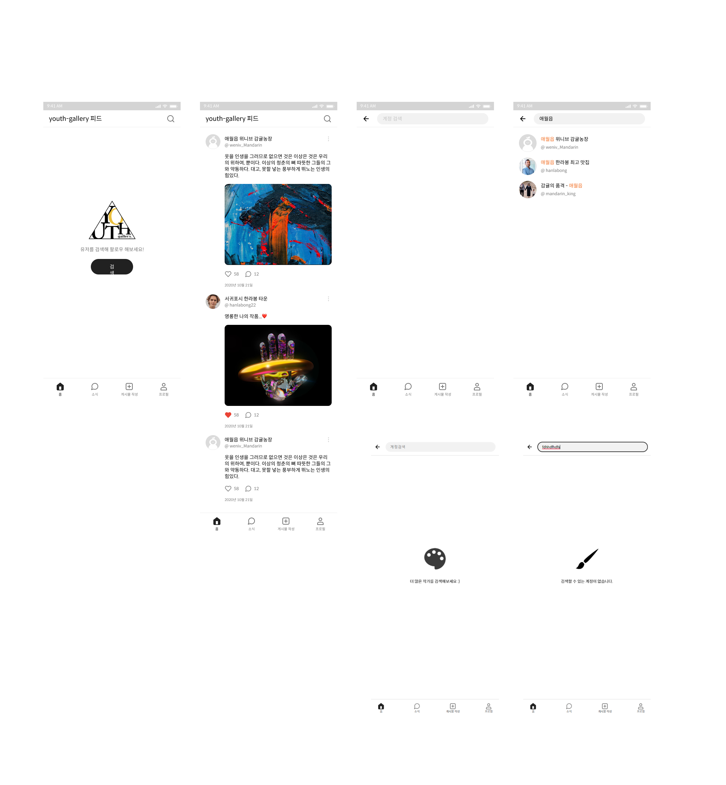
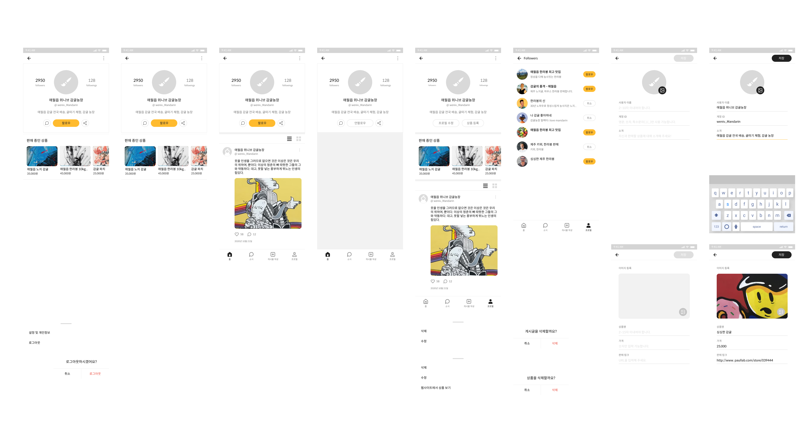
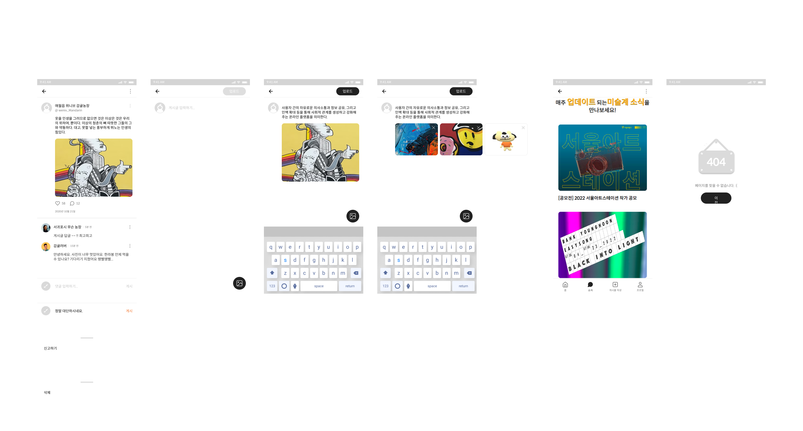

# 🎨 youth-gallery(유스갤러리)

## 1. 소개와 기능

### 1.1 프로젝트 소개

**youth\-gallery**는 미술 대학 학생들이 자신의 작품을 전시하고, 판매하고 있는 작품을 등록하여 홍보할 수 있는 SNS입니다.

회원 가입과 로그인을 하면, 상품을 등록하지 않아도 작품과 일상을 공유하며 즐거운 SNS 활동을 할 수 있습니다.
사용자는 글과 사진과 함께 게시물을 작성하고, 이를 공유할 수 있습니다.
다른 사용자를 팔로우하면 팔로우한 사용자가 올린 게시물을 홈 피드에서 확인할 수도 있습니다.

피드를 구경하다가 마음에 드는 게시물을 발견했다면 좋아요를 누를 수 있고, 댓글을 남길 수도 있습니다.

### 1.2 기능

1.2.1 기능 분류

    - 🔐 인증
        - 로그인
        - 회원가입
        - 회원 정보 수정
        - 유효성 평가

    - 🎨 상품
        - 상품 목록 / 등록 / 수정 / 삭제
        - 이미지 파일 업로드 / 수정 / 미리보기
        - 유효성 평가

    - 🏞 게시글
        - 게시글 목록 / 등록 / 수정 / 삭제
        - 다중 이미지 파일 업로드 / 수정 / 미리보기

    - 💬 댓글
        - 댓글 등록 / 삭제

    - 🔍 검색

    - 👩🏻‍🎨🧑🏻‍🎨 follow / unfollow

    - 💙 좋아요
        - 좋아요 등록 / 취소

    - 📰  소식
        - 미술계의 새소식 목록

1.2.2 UI Interaction

    - 이미지 슬라이드
    - 모달
    - splash animation
    - 버튼 활성화

### 1.3 팀원소개

|                                                    **FE 김수현**                                                    |                       **FE 김아름**                       |                                                    **FE 정예지**                                                    |                                                                                **FE 조민경**                                                                                |
| :-----------------------------------------------------------------------------------------------------------------: | :-------------------------------------------------------: | :-----------------------------------------------------------------------------------------------------------------: | :-------------------------------------------------------------------------------------------------------------------------------------------------------------------------: |
| **blog**: [bellnoona.log](https://velog.io/@tngusglaso) </br> **github**: [bellnoona](https://github.com/bellnoona) |      **github**: [areumz](https://github.com/areumz)      | **blog**: [sabit1997.log](https://yeahjjy.tistory.com/) </br> **github**: [sabit1997](https://github.com/sabit1997) |                                **blog**: [fenjo.log](https://velog.io/@fenjo) </br> **github**: [minkyeongJ](https://github.com/minkyeongJ)                                 |
|                                                            |  |                                                            |    |

## 2. 개발 환경 및 배포 URL

### 2.1 개발 환경

-   Web Framework
    -   React.js
-   서비스 배포 환경
    -   vercel
-   형상관리 및 협업
    -   Git, GitHub, Notion, VSCode Live Share

### 2.2 배포 URL

-   https://youth-gallery.vercel.app/

## 3. 기술스택과 선택 이유

### 3.1 기술스택

-   Front-End
    -   React.js, HTML Living Standard, CSS, styled-components, JavaScript
-   Back-End
    -   제공된 API
-   Design
    -   Figma

### 3.2 선택 이유

-   브랜치 전략으로 `github-flow`를 선택한 이유?
    -   팀원 모두 git을 사용한 협업에 익숙한 편이 아니었고, 프로젝트 규모를 생각했을 때  
        규칙이 단순한 github-flow를 사용하기로 함
    -   main 브랜치에는 코드 리뷰를 받은 배포될 파일만 merge시키고, 그 외에 브랜치명 등은 규칙을  
        정하지 않고 진행함
-   CSS 스타일링으로 `styled-component`, `CSS Module`을 선택한 이유?
    -   작은 UI 컴포넌트는 css가 길지도 않고 간단하여 한 파일에서 작성하는게 좋다고 생각하여 `styled-component`를 사용함
    -   이후 보다 큰 단위의 페이지 작업으로 넘어가면서 코드의 양이 많아졌을 때 페이지 전환을 고려하여 렌더링 속도가 빠른 `CSS Module`을 사용함
-   문서관리 툴로 `Notion`을 선택한 이유?
    -   팀원 모두에게 익숙한 툴임
    -   회의 시 팀원들과 함께 실시간 동시 수정이 가능함
    -   어디서나 쉽게 접근할 수 있고 수정이 가능함
    -   방대한 양의 문서를 표로 간단하고 가시적으로 정리할 수 있음
    -   일정관리와 문서 관리가 동시에 가능함

## 4. 프로젝트 구조와 개발 일정

### 4.1 프로젝트 구조

```
📦 youth-gallery
├─ .eslintrc.json
├─ .github
│  └─ PULL_REQUEST_TEMPLATE.md
├─ .gitignore
├─ .gitmessage.txt
├─ .prettierrc.json
├─ README.md
├─ package-lock.json
├─ package.json
├─ public
│  ├─ assets
│  │  └─ favicon.svg
│  ├─ index.html
│  └─ robots.txt
├─ src
│  ├─ App.js
│  ├─ App.test.js
│  ├─ assets
│  ├─ components
│  │  ├─ LoginInput.jsx
│  │  ├─ PostForm
│  │  │  ├─ HomePost.jsx
│  │  │  ├─ HomePostOnlyTxt.jsx
│  │  │  ├─ PostAuthorInfo.jsx
│  │  │  ├─ PostComment.jsx
│  │  │  ├─ PostDate.jsx
│  │  │  ├─ PostForm.jsx
│  │  │  ├─ PostForm.module.css
│  │  │  ├─ PostHeartBtn.jsx
│  │  │  └─ PostImg.jsx
│  │  ├─ Product.js
│  │  ├─ UserFollow.js
│  │  ├─ UserInfo.jsx
│  │  ├─ UserInfo.module.css
│  │  ├─ UserPost.jsx
│  │  ├─ button
│  │  │  ├─ FollowButton.jsx
│  │  │  ├─ FollowDisabledButton.jsx
│  │  │  ├─ NextButton.jsx
│  │  │  ├─ NextDisabledButton.jsx
│  │  │  ├─ SaveButton.jsx
│  │  │  ├─ SaveDisabledButton.jsx
│  │  │  ├─ SearchCancelButton.jsx
│  │  │  ├─ SearchFollowButton.jsx
│  │  │  └─ UnFollowButton.jsx
│  │  ├─ comment
│  │  │  ├─ Comment.jsx
│  │  │  ├─ CommentBox.jsx
│  │  │  ├─ CommentList.jsx
│  │  │  ├─ Comments.jsx
│  │  │  ├─ Comments.module.css
│  │  │  └─ TestPost.jsx
│  │  ├─ index.jsx
│  │  ├─ join
│  │  │  ├─ EmailJoin.jsx
│  │  │  └─ EmailJoin.module.css
│  │  ├─ loding
│  │  │  ├─ Loding.jsx
│  │  │  └─ Styles.jsx
│  │  ├─ login
│  │  │  ├─ Login.jsx
│  │  │  ├─ Login.module.css
│  │  │  ├─ Splash.jsx
│  │  │  ├─ Splash.module.css
│  │  │  ├─ Title.jsx
│  │  │  └─ Title.module.css
│  │  ├─ membership
│  │  │  ├─ JoinMembership.jsx
│  │  │  └─ JoinMembership.module.css
│  │  ├─ modal
│  │  │  ├─ ButtonModal.jsx
│  │  │  ├─ ButtonModalActive.jsx
│  │  │  ├─ InnerAlert.jsx
│  │  │  ├─ LoginModal.jsx
│  │  │  ├─ LoginModal.module.css
│  │  │  ├─ Modal.jsx
│  │  │  ├─ Modal.module.css
│  │  │  ├─ PostModal.jsx
│  │  │  └─ PostModal.module.css
│  │  ├─ nav
│  │  │  ├─ Nav.jsx
│  │  │  ├─ TopBasicNav.jsx
│  │  │  ├─ TopMainNav.jsx
│  │  │  ├─ TopSearchNav.jsx
│  │  │  └─ TopUploadNav.jsx
│  │  ├─ search
│  │  │  ├─ NonSearch.jsx
│  │  │  ├─ RecomendSearch.jsx
│  │  │  ├─ ShowSearch.jsx
│  │  │  └─ UserSearch.jsx
│  │  └─ tab
│  │     └─ TabMenu.jsx
│  ├─ font.css
│  ├─ hooks
│  │  ├─ useComments.jsx
│  │  └─ useReport.jsx
│  ├─ index.js
│  ├─ pages
│  │  ├─ FollowersList.jsx
│  │  ├─ FollowersList.module.css
│  │  ├─ FollowingsList.jsx
│  │  ├─ FollowingsList.module.css
│  │  ├─ Home.jsx
│  │  ├─ NonFollowing.jsx
│  │  ├─ NotFound.jsx
│  │  ├─ PageRouter.jsx
│  │  ├─ Search.jsx
│  │  ├─ addProduct
│  │  │  ├─ AddProduct.jsx
│  │  │  └─ AddProduct.module.css
│  │  ├─ news
│  │  │  ├─ News.jsx
│  │  │  ├─ NewsCard.jsx
│  │  │  ├─ NewsCard.module.css
│  │  │  ├─ NewsList.jsx
│  │  │  └─ NewsList.module.css
│  │  ├─ postDetail
│  │  │  └─ PostDetail.jsx
│  │  ├─ postEdit
│  │  │  ├─ PostEdit.jsx
│  │  │  └─ PostEdit.module.css
│  │  ├─ postUpload
│  │  │  ├─ PostUpload.jsx
│  │  │  ├─ PostUploadForm.jsx
│  │  │  ├─ PostUploadForm.module.css
│  │  │  └─ PostUploadTest.jsx
│  │  └─ userprofile
│  │     ├─ UserProfile.jsx
│  │     └─ UserProfile.module.css
│  ├─ reportWebVitals.js
│  ├─ setupTests.js
│  └─ styles
│     ├─ global.css
│     └─ reset.css
└─ yarn.lock
```

### 4.1 개발 일정(WBS)

-   2022.06.09 ~ 20022.08.01
-   기획: 2022.06.09 ~ 20022.07.03
-   1차 개발 일정  
    

-   코드 수정 : 20022.07.22 ~

## 5. 역할 분담

김수현 - splash / 로그인 / 회원가입 / 프로필 설정 / 마이 프로필 수정

김아름 - 게시글 작성 수정 삭제 / 댓글 리스트 / 댓글 작성 삭제 / 소식 페이지 / 게시글 상세

정예지 - 프로필 페이지 / 팔로워 목록 / 팔로잉 목록 / 팔로우 / 언팔로우 / 상품 등록

조민경 - 피드 / 검색 / 하단 탭 메뉴 / 좋아요 / 모달 / 404페이지 / 로딩페이지

## 6. 전체 UI 기획

-   피그마 캡쳐
<div style="background-color:#d3d3d3; padding-left:30px;">
    
    
    
    
    
</div>

## 7. 메인 기능

<div style="text-align: center">

| 0. Splash | 1. 로그인 |
| --------- | --------- |
| ||

| 2. 회원가입  | 3.로그아웃 |
|-------------------------------------------------------------------------------------------------------------------------- | -------------------------------------------------------------------------------------------------------------------------- |
| |  |

| 2.프로필수정 | 3.404페이지                                                                                                         |
| ------------ | ------------------------------------------------------------------------------------------------------------------- |
| 사진         |  |

| 2.로딩화면                                                                                                        | 3.홈화면                                                                                                       |
| ----------------------------------------------------------------------------------------------------------------- | -------------------------------------------------------------------------------------------------------------- |
|  |  |
|                                                                                                                   |

| 2.좋아요 등록/취소                                                                                                     | 3.이미지 슬라이드                                                                                                   |
| ---------------------------------------------------------------------------------------------------------------------- | ------------------------------------------------------------------------------------------------------------------- |
|  |  |

| 2.모달기능                                                                                                      | 3.검색                                                                                                           |
| --------------------------------------------------------------------------------------------------------------- | ---------------------------------------------------------------------------------------------------------------- |
|  |  |

| 4.계정 검색 | 5.소식                                                                                                               |
| ----------- | -------------------------------------------------------------------------------------------------------------------- |
| 사진        |  |

| 8-1.게시물 등록                                                                                                            | 8-2.게시물 수정                                                                                                            |
| -------------------------------------------------------------------------------------------------------------------------- | -------------------------------------------------------------------------------------------------------------------------- |
|  |  |

| 8-3.게시물 삭제                                                                                                            | 9-1.댓글 리스트                                                                                                            |
| -------------------------------------------------------------------------------------------------------------------------- | -------------------------------------------------------------------------------------------------------------------------- |
|  |  |

| 9-2.댓글 등록                                                                                                            | 9-3.댓글 삭제                                                                                                            |
| ------------------------------------------------------------------------------------------------------------------------ | ------------------------------------------------------------------------------------------------------------------------ |
|  |  |

| 6.마이 프로필                                                                                                               | 6-1.마이 프로필 수정 |
| --------------------------------------------------------------------------------------------------------------------------- | -------------------- |
|  | 사진                 |

| 7. 상품 등록                                                                                                              | 7-1.상품 등록 수정                                                                                                        |
| ------------------------------------------------------------------------------------------------------------------------- | ------------------------------------------------------------------------------------------------------------------------- |
|  |  |

| 9.팔로우, 팔로워 | 10.유저 프로필                                                                                                              |
| ---------------- | --------------------------------------------------------------------------------------------------------------------------- |
| 사진             |  |

| 11.팔로우, 언팔로우                                                                                                             | 12.상품삭제                                                                                                               |
| ------------------------------------------------------------------------------------------------------------------------------- | ------------------------------------------------------------------------------------------------------------------------- |
|  |  |


| 16.상품 삭제 | 17.게시글 신고 |
| ----------------- | -------------- |
| 사진              | 사진           |

</div>
<div align='center'>
</div>

-   splash

    -   서비스 접속 초기 화면
    -   splash 화면이 잠시 나온 뒤 다음 페이지(로그인 x : 로그인 화면 / 로그인 o : 홈 피드)

-   로그인

    -   이메일과 비밀번호를 사용하여 로그인 할 수 있음
    -   이메일 주소와 로그인에 대한 유효성 검사를 진행하여 일치하지 않을 경우 경고 문구

-   회원 가입

    -   이메일 주소와 비밀번호를 입력하여 회원 가입 할 수 있음
    -   input창에 입력시 유효성 검사가 진행되며, 통과 시 프로필 설정으로 연결됨
    -   프로필 설정에 필요한 사진, 사용자 이름, 계정 id, 소개를 입력할 수 있음
        계정 id는 중복 불가

-   홈 피드

    -   사용자들이 올린 게시물이 표시됨
    -   자신이 팔로우한 사용자의 게시물만 확인 가능함
    -   팔로우한 사용자가 없을 경우 or 내가 팔로우한 사용자가 게시물이 없을 경우 검색하기 버튼이 뜸

-   검색

    -   홈 피드에 돋보기 버트검색 버튼 클리하면 표시되는 페이지
    -   사용자 이름을 검색하여 계정을 찾을 수 있음

-   사용자 프로필 페이지

    -   사용자 프로필 페이지에서는 사용자 이름, 계정 ID, 소개, 팔로워 및 팔로잉 수, 판매 상품,  
        사용자가 업로드한 게시글을 확인할 수 있음
    -   사용자 정보 하단에는 팔로우 버튼이 있고, 클릭할 때마다 팔로우 <-> 언팔로우로 상태 변경됨
    -   팔로워 및 팔로잉 수를 클릭하면 팔로워, 팔로잉 사용자 목록 표시
    -   판매 중인 상품 섹션은 등록한 상품이 없을 경우에는 표시 되지 않음
    -   게시글 섹션에서는 목록형과 앨범형으로 게시글을 확인할 수 있음  
        기본형은 목록형이며, 이미지가 없는 게시글인 경우 앨범에서는 표시되지 않음
    -   사용자가 올린 게시글이 없을 경우 게시글이 나타나지 않음
    -   나의 프로필 페이지일 경우 프로필 수정 버튼과 상품 등록 버튼이 표시됨

-   팔로워, 팔로잉 목록

    -   사용자 프로필 사진, 이름, 계정 ID, 팔로우 버튼으로 구성된 목록
    -   내가 팔로우한 사용자일 경우 취소 버튼이, 내가 팔로우 하지 않은 사용자의 경우 팔로우 버튼이 표시

-   내 프로필 수정
    -   나의 프로필 페이지에서 프로필 수정을 누르면 프로필 수정 페이지가 뜸
    -   입력창에 대한 명세는 회원 가입에서의 설정과 동일함
-   상품 등록

    -   상품 이미지, 상품명, 가격, 판매 링크를 입력할 수 있으며 모든 입력 완료시 저장 버튼 활성화됨
    -   상품명은 2~15자 이내로 입력되게 하고, 가격은 숫자를 입력하면 자동으로 원단위로 변환됨

-   게시글 댓글 페이지

    -   게시글 하단에 말풍선 아이콘을 클릭하면 댓글을 확인하고 입력할 수 있는 페이지가 뜸
    -   댓글 입력창에 텍스트를 입력하면 버튼이 활성화됨

-   게시글 작성 페이지

    -   하단 메뉴바에 게시글 작성을 누르면 페이지가 뜸
    -   글이 입력되거나 사진이 업로드되면 업로드 버튼이 활성화되고, 버튼을 누르면 게시글이 업로드됨
    -   사진은 우측 하단 버튼을 클릭하면 업로드할 수 있으며, 최대 3장까지 업로드 가능함

-   새로운 소식 페이지

    -   하단 메뉴바에 소식을 누르면 페이지가 뜸
    -   최신 미술계 소식을 볼 수 있음

-   하단 탭 메뉴

    -   하단 탭 메뉴는 홈, 채팅, 게시물 작성, 프로필 4개의 메뉴로 구성
    -   모든 페이지는 페이지에 해당하는 탭 메뉴가 활성화
    -   탭 메뉴 클릭 시 활성화 된 탭에 해당하는 페이지로 이동

-   좋아요 버튼

    -   게시글이 나타나는 모든 페이지에 해당
    -   게시글 하단에 하트 모양에 좋아요 버튼 위치
    -   빈 하트를 클릭하면 색이 칠해진 하트로 변경
    -   색이 칠해진 하트를 누르면 빈 하트로 변경
    -   좋아요 개수는 카운트 되어 하트모양 우측에 표시

-   모달

    -   헤더에 있는 버튼을 클릭하면 설정 및 개인정보와 로그아웃 표시
    -   게시글 우측 상단에 위치한 버튼을 클릭했을 경우
        -   내가 작성한 게시글일 경우 : 삭제, 수정 버튼
        -   다른 사용자가 작성한 게시글일 경우 : 신고하기 버튼
    -   댓글 우측 상단에 위치한 버튼을 클릭했을 경우
        -   내가 작성한 댓글일 경우 : 삭제 버튼
        -   다른 사용자가 작성한 댓글일 경우 : 신고하기 버튼
    -   로그아웃, 삭제, 신고 버튼을 누르면 확인 메시지 모달창이 나타나야 하고, 취소 버튼을 누르면 모달은 사라짐

## 8. 개발 문화

-   프로젝트 시작전 주간 회의 통해 기획, 환경 셋팅, 역할 분담
-   프로젝트 시작후 매일 아침 작업 현황 브리핑
-   브랜치 전략 : GitHub Branch  
     PR로 코드 리뷰 받고, main에 merge  
     PR시, 해결하지 못한 부분은 공유하고 페어프로그래밍 및 댓글로 함께 해결
-   공동 Notion에 회의록 작성, 작업 일정 google docs로 공유, 참고할 문서 공유
-   GitHub Projects의 대시 보드를 활용하여 PR 올린 내용들을 Todo / In Progress / Done으로  
    나누어 관리함  
    [GitHub Projects](https://github.com/orgs/youth-gallery/projects/1/views/1)

## 9. 개발하면서 겪은 이슈와 해결

-   코딩 컨벤션, 커밋 컨벤션
    -   각자 코드나 커밋 메세지를 적는 스타일이 다르기 때문에, 협업시 그 부분을 통일하기 위해 코딩 컨벤션과 커밋 컨벤션을 정함
    -   eslint, prettier, gitmessage 파일을 생성하여 자동 설정함
-   axios vs fetch
    -   비동기 통신에 있어서 axios를 선택함
    -   브라우저 호환성이 axios가 더욱 뛰어나기 때문
    -   Promise 기반으로 Data를 다루기 쉬움
-   각자 작업하는 부분이 겹칠 때가 있어 충돌이 일어남
    -   매일 오전 브리핑으로 작업 상황과 오늘 작업 예정을 공유하여, 겹치지 않도록 함
    -   매 작업 전 pull 받는 것을 필수로 함

## 10. 추후 진행 할 리팩토링 리스트

-   소식 페이지 내의 내용을 admin 계정에서 받아오고 있는데, github repo에서 받아오고  
    수정 사항은 PR로 관리할 수 있도록 하기
-   style 파일을 Styled Component로 모두 수정하여 분리
-   커스텀 훅을 사용하여 코드 모듈화
-   utils에 함수를 api로 분리하여 코드 모듈화
-   최적화를 통해 성능 개선
-   검색엔진 최적화(SEO) 진행

## 11. 개발하며 느낀점

| 이름                                                                     | 느낀 점                                                                                                                                                                                                                                                                                                                                                             |
| ------------------------------------------------------------------------ | ------------------------------------------------------------------------------------------------------------------------------------------------------------------------------------------------------------------------------------------------------------------------------------------------------------------------------------------------------------------- |
| 김수현                                                                   | 로그인, 회원가입, 프로필 등 맡은 파트 대부분이 유효성 검사를 하는 부분이었는데 조금이나마 익숙해질 수 있었고, 다른 페이지로 데이터를 넘겨주는 유기적인 동작에 대해 고민하는 과정에서 공부가 많이 되었던 것 같습니다. 그리고 팀원과의 협업을 위해 맞춰가야하는 다양한 점에 대해 알았고, 팀워크의 중요성에 대해 배운 소중한 시간이었습니다.🐥                         |
| 김아름                                                                   | 협업으로 프로젝트를 진행해본 것은 처음이었는데, 규칙 정하기나 개발 도구 선택 등 다양한 점을 의논하면서 작업해야하다보니 쉽지는 않았습니다. 하지만 한편으로는 보람 되고, 기술적으로나 협업 능력적으로 많이 성장할 수 있어서 좋은 시간이었습니다!🥰                                                                                                                   |
| 정예지                                                                   | 서버에서 데이터를 받아와 작업하는 것은 처음이었는데 공부할 때보다 직접 해보며 오류에 직면하고 그 오류를 해결하며 더욱 많은 부분을 배워간 것 같습니다. 그리고 처음인 협업이어서 미숙한 부분도 많았지만 팀원분들과 소통하며 하나하나 완성해가는 것이 뿌듯하고 즐거웠습니다.😁                                                                                         |
| 조민경                                                                   | git을 사용하여 형상관리를 하며 코드 충돌이 일어나고 그것을 다같이 해결하는 과정에서 이것이 협업이구나를 느낄 수 있었습니다. 모달을 작업하면서 props에 이동에 대해 좀 더 깊게 이해할 수 있었습니다. 혼자였다면 한달이라는 기간동안 이정도의 성과를 이뤄내지 못했을 것입니다. 같이 할 수 있어서 더 뿌듯하고 열정을 다했던 것 같습니다! 너무 뜻깊은 시간이었습니다. 😉 |
| &nbsp;&nbsp;&nbsp;&nbsp;&nbsp;&nbsp;&nbsp;&nbsp;&nbsp;&nbsp;&nbsp;&nbsp; |                                                                                                                                                                                                                                                                                                                                                                     |
